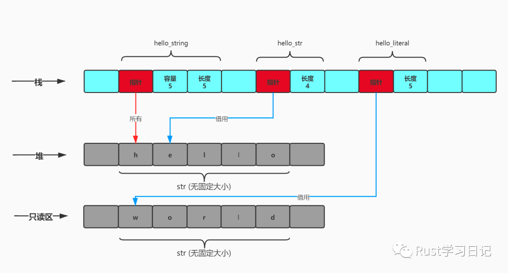

# 字符串(String)

## 字符串定义

在Rust中有两种字符串类型：

* `&str`：原始的字符串类型str（发音：/stɜːr/），常被叫做字符串切片，它通常以不可变借用的形式出现，即&str。它是一种固定长度的字符串，不能随意更改其长度。咱们经常写的字符串字面量就是`&str`类型。
* `String`：这种字符串类型是一种可变长度的字符串，可以随意更改它的长度。String其实就是一个结构体，它里面封装了向量类型。这也很好理解它为什么是可变的了吧。

```rust
pub struct String {
    vec: Vec<u8>,
}
```

## 换行符

如果定义的字符串比较长，通常在代码中习惯性的加上换行符，那么也会将换行符输出。但是通常，咱们换行只是为了代码美观，这时如果在需要换行的地方以`\`结尾，则会忽略当前行的换行符和下一行的开头空白符。

示例代码如下：

```rust
    // 换行
    let hello4 = "My name is Betty, 18 years old. I like play piano very much and was awarded
    of a numbers of prizes for that.";
    println!("hello4 = {}", hello4);

    // 忽略换行符
    let hello5 = "My name is Betty, 18 years old. I like play piano very much and was awarded \
    of a numbers of prizes for that.";
    println!("hello5 = {}", hello5);
```

代码运行结果

```rust
hello4 = My name is Betty, 18 years old. I like play piano very much and was awarded
    of a numbers of prizes for that.
hello5 = My name is Betty, 18 years old. I like play piano very much and was awarded of a numbers of prizes for that.

```

## 原始字符串（Raw String）

有的时候是不是感觉转义其实是一个很烦的事情，尤其是在输入windows文件路径的时候。别着急，Rust提供了一种Raw String类型，字面翻译是未经处理的字符串，原始字符串。

*Raw String*定义：Raw String以小写字面r为标记，其中的所有反斜杠和空白符都会原样的包含在字符串中，转义符在其中无效。如果原始字符串中包含英文引号，则需要在字符串的开头和结尾添加#号标记。（#号数量可自己定义，但是开头和结尾的数量一定要相等。）

示例代码如下:

```rust
    // 测试转义
    let raw_str = r"D:\study_rust\013\string";
    println!("raw_str = {}", raw_str);

    // 测试引号
    let raw_str_ref = r##"测试引号"英文引号",英文引号会原样输出！！"##;
    println!("raw_str_ref = {}", raw_str_ref);
```

输出结果如下:

```rust
raw_str = D:\study_rust\013\string
raw_str_ref = 测试引号"英文引号",英文引号会原样输出！！
```

## 字节字符串 （Byte String）

字节字符串就是前缀带有`b`的字符串字面量，类似于字节字符。字节字符串的是`u8`值（字节）的切片，只能包含ASCII字符和\\xHH转义序列，其不能包含任何Unicode字符。

PS：它不支持在后面将要介绍的所有字符串的方法，其最像字符串的地方就是它的语法了。但是它支持上面介绍的跨行，转义，原始字节字符串。其中，原始字节字符串以br开头。

```rust
    // 字节字符串
    let byte_str = b"a byte string!";
    println!("byte_str = {:?}", byte_str);

    // 原始字节字符串
    let raw_byte_str = br#"it is a "raw byte string"."#;
    println!("raw_str_ref = {:?}", raw_byte_str);
```

```rust
byte_str = [97, 32, 98, 121, 116, 101, 32, 115, 116, 114, 105, 110, 103, 33]
raw_str_ref = [105, 116, 32, 105, 115, 32, 97, 32, 34, 114, 97, 119, 32, 98, 121, 116, 101, 32, 115, 116, 114, 105, 110, 103, 34, 46]
```

其实它实际上就是`&[u8;N]`——哈哈，这不就是上节课介绍的切片引用吗。`byte_str`就是包含14个字节的数组的切片引用。

## 可变长度字符串（String）

前面提到过，String类似于Vec<T>，其本质就是一个字段为Vec<u8>类型的结构体。每个String都有在堆上分配的缓冲区，不跟其它的String共享。当String变量超出作用域后其缓冲区会自动释放，除非String的所有权发生转移（有关所有权的知识点在后续章节介绍）。当然String它在栈上也是由3部分组成，分别是指向堆上的字节序列的指针、记录堆上字节序列的长度、在堆上分配的容量。

### 创建字符串

创建字符串的常见的方式有三种：

#### 1、使用String::new创建空的字符串。

```rust
let empty_string = String::new();
```

#### 2、使用String::from通过字符串字面量创建字符串。实际上复制了一个新的字符串。

```rust
let rust_str = "rust";

let rust_string = String::from(rust_str);
```

***为什么是说它是复制了一个新的字符串呢？***

`as_ptr()`方法可以打印`rust_str`和`rust_string`指向堆的内存地址。

示例代码如下：

```rust
println!("rust_str 字面量指向的地址 {:?}", rust_str.as_ptr());
println!("rust_string 指向的地址 {:?}", &rust_string.as_ptr());
```

代码运行结果

```rust
rust_str 字面量指向的地址 0x1048312b4
rust_string 指向的地址 0x600002124060
```

结果就是不一样，他们指向堆的地址是两个不同的地址。也就是说，在堆上有两个地方保存了`rust`这个字符串。

#### 3、使用字符串字面量的to\_string将字符串字面量转换为字符串。实际上复制了一个新的字符串。

```rust
let s1 = "rust_to_string";
let s2 = s1.to_string();
```

`to_string()`实际上是封装了`String::from()`，如下图源码：

```rust
impl ToString for str {
    #[inline]
    fn to_string(&self) -> String {
        String::from(self)
    }
}
```

## 可变长度字符串String和向量Vector

### 联系和区别

上节提到过，可变长度字符串*String*其实是一个结构体，里面封装了*Vec<T>*，那么它跟向量又存在什么样的联系和区别呢？具体看下面的表格。


| 功能                                | Vec<T>          | String          |
| ----------------------------------- | --------------- | --------------- |
| 自动释放内存                        | 是              | 是              |
| 可扩展                              | 是              | 是              |
| ::new()和::with\_capacity()静态方法 | 是              | 是              |
| .reverse()和.capacity()方法         | 是              | 是              |
| .push()和.pop()方法                 | 是              | 是              |
| 范围语法s[start...end]              | 是              | 是              |
| 自动转换                            | &Vec<T> 到 &[T] | &String 到 &str |
| 继承方法                            | 继承自 &[T]     | 继承自 &str     |

### String的构成

String\*类型的分别由三部分构成，分别与其三个方法相对应：

1、`as_ptr()`：指向堆中字节虚了的指针

2、`len()`：堆中字节序列的字节长度

3、`capacity()`：在堆上分配的容量

示例代码如下：

```rust
    let mut hello = String::with_capacity(15);

    hello.push('h');
    hello.push('e');
    hello.push('l');
    hello.push('l');
    hello.push('o');

    println!("hello 字符串的内容 -> {}", hello);

    println!("hello 堆上的指针 -> {:p}", hello.as_ptr());
    println!("hello 的容量 -> {}", hello.capacity());
    println!("hello 的字节长度 -> {}", hello.len());
  
    println!("hello 栈上的指针 -> {:p}", &hello); 
```

运行结果如下:

```rust
hello 字符串的内容 -> hello
hello 堆上的指针 -> 0x6000019ac080
hello 的容量 -> 15
hello 的字节长度 -> 5
hello 栈上的指针 -> 0x16d416398

```

### 字符串在内存的表示

为什么Rust要设计两种字符串？它们有什么区别？前面讲了那么多，也都是概念，真正要搞明白它们之间的关系，还要深入到内存里面去剖析。

下面就一起来剖析*String*，*&str*，*str*，字面量的关系。

```rust
let hello_string = String::from("hello");
let hello_str = &hello_string[1..];
let hello_literal = "world";
```


* 


`hello_string`是一个可变长度的字符串，它在内存中的结果与向量类似，真正的字符串则存放在堆上。在堆上给*String*分配一个可伸缩缓冲区，因此可以按需来调整其大小。

`hello_str`是一个字符串切片，是对其它变量拥有的一段UTF-8文本的引用。它只是“借用”了这些文本而已。`&str`其实也是一个胖指针（*Fat Pointer*），包含实际数据的地址和其长度。可以把`&str`想象成一个`&[u8]`，只不过他能存储格式完好的UTF-8。

`hello_literal`是一个字符串字面量，它通常跟程序的机器码存储在预分配的只读内存区，当程序执行的时候创建，程序退出时会自动释放。


### 扩展

##### 什么是胖指针（Fat Pointer）？

定义：胖指针（*Fat Pointer*）是一个双字宽的值，它除了指向对象的地之外，还会额外存储长度信息。

通俗点说，普通指针通常是占内存8个字节，而胖指针则是占内存16个字节，因为它比较宽，所以叫胖指针。如切片（*Slice*）类型，它保存着指向堆上的地址和长度。

##### 如何理解str类型？

在Rust中是没有GC的，程序的内存由编译器去分配，代码最终编译为LLVM IR，其携带了内存分配的信息。因此，要更合理的分配内存，编译器必须预先知道类型的大小。

然而`str`则是无固定大小的字符串，它仅仅是个类型而已，无法确定其大小，在运行时之前没有人知道它的大小。而在Rust中，大部分的类型都是可以在编译期确定大小的类型（Sized Type），如：`i32`占4个字节，`i64`占8个字节，在程序编译期就可以确定它的大小。当然也存在动态大小的类型（Dynamic Sized Type），经常简称为DST，如：`str`，由于它无法在编译期确定大小，因此就不能声明。对于这种情况，在Rust则提供了引用类型，字符串切片的引用类型`&str`。因为它是胖指针，可以在编译期确定大小哦。
